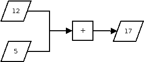

# Data Types, Operations, and Variables
One way to understand programming is as a process of _transforming_ data. A simple calculator performing addition is programmed, for example, to transform two numbers into one.

<center>

</center>

It is therefore necessary to consider,

1. Types of data
2. Operations on data
3. Naming of data

## Data Types and Their Operations
There are many built-in data types in python[^1]. For now, we need only focus on the following,

* Integers (`int`)
* Strings (`str`)
* Booleans (`bool`)

[^1]: For the curious, see the [docs](https://docs.python.org/3.6/library/stdtypes.html).

### Integers
Integers represent whole numbers, such as 0, 12, 93214, -1, and so on. In IDLE, try the following, and observe the output:

```python
>>> 1
>>> 52
>>> 0
>>> -3
>>> 2 + 6
>>> 2 - 6
>>> 2 * 6
>>> 2 ** 6
>>> 2 / 6
>>> 2 // 6
>>> 2 % 6
>>> 2 / 0
>>> 2 // 0
```

As you may have noticed some familiar **operators**, such as addition (`+`), subtraction (`-`), multiplication (`*`), and division (`/`). The double asterisks (`**`) is the 'power' operator, which raises the first number to the power of the second; the double forward slashes (`//`) is the 'floored division' operator, which divides the first number by the second and gives the answer rounded down. The percent sign (`%`) is the modulo operator, which gives the remainder of the division of the first number by the second.[^2]

[^2]: I use the term 'number' here, instead of integer, as these operations can also apply to other data types, including other representations of numbers.

The last two expressions raises an error, as division by zero is not allowed. 

```python
Traceback (most recent call last):
  File "<stdin>", line 1, in <module>
ZeroDivisionError: division by zero
```

Errors in programming are extremely common, but generally harmless. Don't be afraid to run a command and fail! 

### Strings
Strings are sequences of characters, which can include letters, numbers, and symbols. Strings _must_ be surrounded by either single quotes (`'`) or double quotes (`"`).[^3] Try the following examples in IDLE:

[^3]: Which type of quotation marks you use depends on your preference, and sometimes the context. [Here](https://www.codecademy.com/en/forum_questions/5375491180ff33f9370002c7) is a decent forum post on this issue.

```python
>>> 'abcg'
>>> '!@#$%&'
>>> '12347'
>>> 'abc123'
>>> 'This is a sentence'
>>> 'You can use single quotes'
>>> "or double quotes"
>>> 'as long as you use the same ones for each string...'
>>> "There can be 4 mix 0f numbers, and symb*$s!"
```

If you find the IDLE spitting errors, for example,
```python
>>> 'This is a sentence
  File "<stdin>", line 1
    'This is a sentence
                      ^
SyntaxError: EOL while scanning string literal
```

Make sure that you have surrounded both ends of the string with quotation marks, and that for each string you have used the same type of quotation marks.
