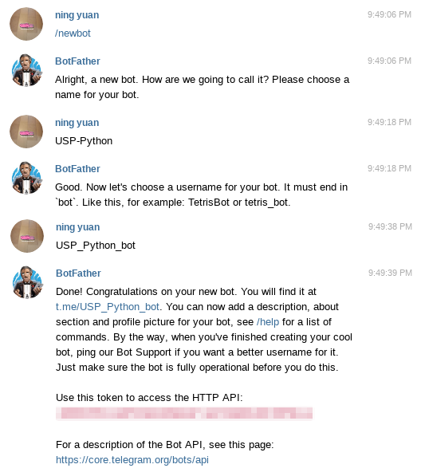
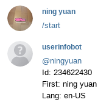
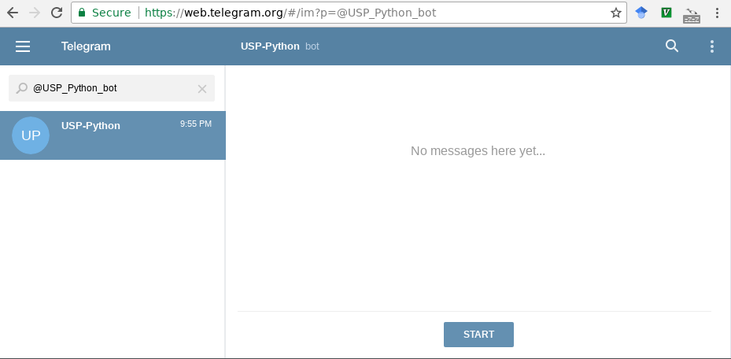
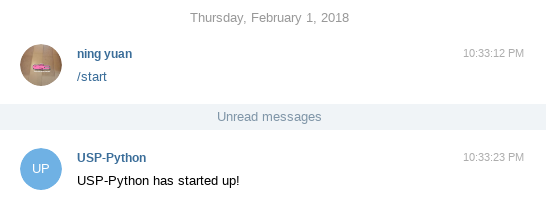

## Creating a Bot Account
First, we need to have a telegram account (bot) to access. Talk to [@Botfather](https://t.me/botfather), a telegram bot by telegram to create telegram bots, to create a bot. Copy and paste the HTTP API somewhere.[^1]

[^1]: And keep it private! This is analogous to a password---anyone with this string of characters can access your bot.

<center></center>

You will also need to know your own telegram user ID, so the bot knows who to send messages to. Talk to [@userinfobot](https://t.me/userinfobot) to get this information. Once again, copy this information down somewhere.

<center></center>

Finally, before we start writing code, we have to `/start` our bot.

<center></center>

## Sending a Message, Part 1
Now, let's write our program. In the first few lines, we need to import the telegram library, and store our HTTP API and user ID in some variables.

```python
import telegram

api_key = '<your api key here>'
user_id = '<your user id here>'
```

Now, we need to store a _representation_ of the telegram bot into a variable. After this, we will be able to use that variable to tell our bot what to do. Use the `Bot` _method_ of the `telegram` library like so, passing the HTTP API `api_key` as argument[^2].

[^2]: Methods are similar to functions. We are in fact using the `Bot` method (function) to _construct_ a `Bot` object, which we store in the variable `bot`. This `Bot` object further has methods which will allow us to do things like send messages, photos, videos...

```python
bot = telegram.Bot(token=api_key)
```

Finally, we are ready to send a message from our bot. Use the `send_message` method, with appropriate arguments to tell the bot where to send the message to (`chat_id`), and what to say (`text`).

```python
bot.send_message(chat_id=user_id, text='USP-Python has started up!')
```

Save your file, and run the program.

<center></center>

Don't be intimidated by these methods! They work like functions do:

- They have a name, such as `telegram.Bot`, or `bot.send_message`[^3]
- They have rounded brackets right after their name...
- and within these brackets are arguments such as `chat_id=user_id`

[^3]: Or, the `Bot` method of the module `telegram`, and `send_message` of the object `bot`, if you want to be _technically_ precise.

The only difference is that we must use the `argument_name=argument_value` notation.[^4]

[^4]: We have been using _positional_ arguments. These are _keyword_ arguments. [Read more?](https://stackoverflow.com/a/1419160/6910451)

## Checkpoint

```python
import telegram

api_key = '<your api key here>'
user_id = '<your user id here>'

bot = telegram.Bot(token=api_key)
bot.send_message(chat_id=user_id, text='USP-Python has started up!')
```

## Questions & Exercises

1. What is the type of `api_key` and `user_id`?  
<a class='toggle_answer' id='06q1'></a> 
<span class='answer' id='06q1a'>They are strings.</span>
2. Modify your program so that it sends a second message of your liking.
3. Modify your program so that it sends a message to someone else.
