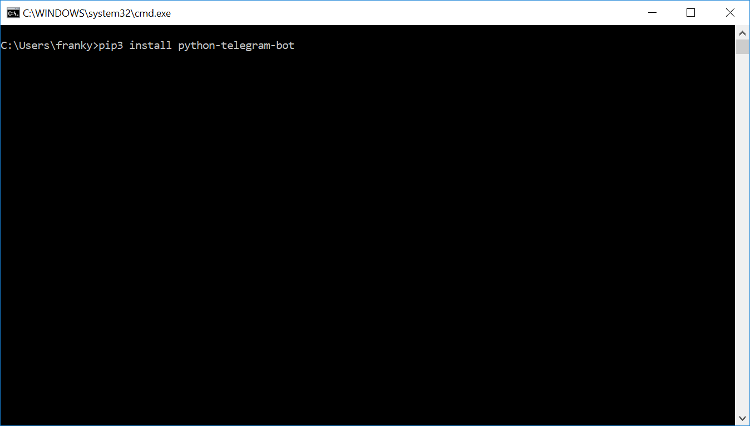

# Set-Up
Welcome to an _Introduction to Python with Telegram Bots_. To begin, we must first set up the [python programming language](https://www.python.org/)[^1][^2] and the [python-telegram-bot library](https://python-telegram-bot.org/). **Please complete these installation before the workshop.**

[^1]: To be more precise, this is the CPython _interpreter_ for the python programming language. This tells the computer how to 'make sense' of python code.
[^2]: We are using Python 3, which is a version of python. Make sure that you're not getting Python 2!

Instructions for Windows and macOS operating systems follow[^3]. If you run into any problems, you may contact through telegram:

[^3]: If you're able to run an OS that is not Windows or macOS (_ABSOLUTELY PROPRIETARY_), then I assume you can handle the installation by yourself.

- [@ningyuan](http://t.me/ningyuan)

## Windows

Download the latest Python 3 package from the [official website](https://www.python.org/downloads/).
<center></center>

Run the installation with the default configuration. **Take note of where python is being installed**, we will need this later. Take a screenshot of it, or write it down somewhere.
<center></center>

After the installation has completed, we will need to add the python package manager to the system path, in order to install the *python-telegram-bot* package. First, find the 'advanced system settings' through the control panel. We recommend you use the search function.
<center></center>

Then, click on 'environment variables'.
<center></center>

Select the '_Path_' variable, and click edit.
<center></center>

Click on new. Here, we enter the path to pip3, the Python 3 package manager. The path should look something like this,
```
C:\Users\<your_username>\AppData\Local\Programs\Python\Python<version-number>\Scripts
```

**Do not simply copy and paste the above.** Remember in the second step when we said to take note of where python is being installed? This is just the "_Scripts_" folder within that location. So, from the first step, simply add in `"\Scripts"`. 

_(Refer to where Python was installed in the second step. Then, add `\Scripts` to the end of that.)_

Be careful though, as adding in the wrong path will not produce an error in this step. Rather, the later steps will fail. If you want to make sure, you can navigate to the `AppData` folders by typing in `%appdata%` in the windows search menu. 
<center></center>

You should have something that looks like this. Press 'OK' on everything, and proceed on to the next step.
<center></center>

Open up the windows command prompt. You can do this by searching for the application _'Command Prompt'_, or by opening up the run window with the Windows Key + `R`, and typing in `cmd`.

Enter the following command to execute the installation.
```
pip3 install python-telegram-bot
```
<center></center>

If your installation has been successful, it'll look something like this!
<center></center>

## macOS

1. Download and install python version 3.6.4 from the website https://www.python.org/downloads/mac-osx/. 
2. Download and install python-telegram-bot. 

Open your terminal (just search for "terminal"). Just type in the following line to install:

```
pip3 install python-telegram-bot
```


